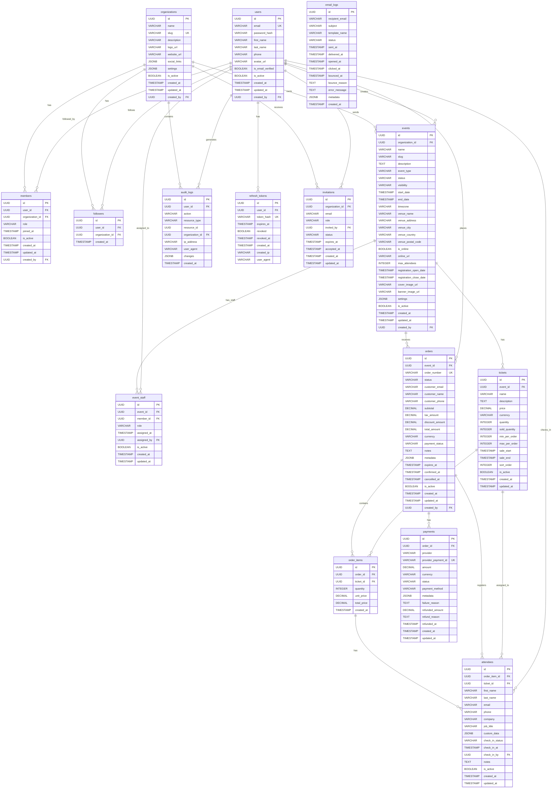

# Database Schema Design

## Overview

This document defines the database schema for OpenMeets. All tables use UUID as primary keys and include soft delete support (`is_active`), audit fields (`created_at`, `updated_at`, `created_by`).

---

## Entity Relationship Diagram



---

## Core Tables

### 1. users

Stores user account information.

| Column | Type | Constraints | Description |
|--------|------|-------------|-------------|
| id | UUID | PRIMARY KEY | Unique user identifier |
| email | VARCHAR(255) | UNIQUE, NOT NULL | User email (login identifier) |
| password_hash | VARCHAR(255) | NOT NULL | Bcrypt hashed password |
| first_name | VARCHAR(100) | NOT NULL | User first name |
| last_name | VARCHAR(100) | NOT NULL | User last name |
| phone | VARCHAR(20) | NULL | Phone number |
| avatar_url | VARCHAR(500) | NULL | Profile picture URL |
| is_email_verified | BOOLEAN | DEFAULT FALSE | Email verification status |
| is_active | BOOLEAN | DEFAULT TRUE | Soft delete flag |
| created_at | TIMESTAMP | DEFAULT NOW() | Creation timestamp |
| updated_at | TIMESTAMP | DEFAULT NOW() | Last update timestamp |
| created_by | UUID | FK → users.id | Creator (for audit) |

**Indexes:**
- `idx_users_email` (email)
- `idx_users_is_active` (is_active)
- `idx_users_created_at` (created_at)

---

### 2. organizations

Stores organization information (multi-tenant container).

| Column | Type | Constraints | Description |
|--------|------|-------------|-------------|
| id | UUID | PRIMARY KEY | Unique organization identifier |
| name | VARCHAR(255) | NOT NULL | Organization name |
| slug | VARCHAR(100) | UNIQUE, NOT NULL | URL-friendly identifier |
| description | TEXT | NULL | Organization description |
| logo_url | VARCHAR(500) | NULL | Logo image URL |
| website_url | VARCHAR(500) | NULL | Organization website |
| social_links | JSONB | DEFAULT {} | Social media links |
| settings | JSONB | DEFAULT {} | Organization settings |
| is_active | BOOLEAN | DEFAULT TRUE | Soft delete flag |
| created_at | TIMESTAMP | DEFAULT NOW() | Creation timestamp |
| updated_at | TIMESTAMP | DEFAULT NOW() | Last update timestamp |
| created_by | UUID | FK → users.id | Creator (first admin) |

**Indexes:**
- `idx_organizations_slug` (slug)
- `idx_organizations_is_active` (is_active)
- `idx_organizations_created_by` (created_by)

---

### 3. members

Organization membership (users ↔ organizations many-to-many with roles).

| Column | Type | Constraints | Description |
|--------|------|-------------|-------------|
| id | UUID | PRIMARY KEY | Unique membership identifier |
| user_id | UUID | FK → users.id, NOT NULL | User reference |
| organization_id | UUID | FK → organizations.id, NOT NULL | Organization reference |
| role | VARCHAR(50) | NOT NULL | Role: admin, member |
| joined_at | TIMESTAMP | DEFAULT NOW() | Membership start date |
| is_active | BOOLEAN | DEFAULT TRUE | Membership status |
| created_at | TIMESTAMP | DEFAULT NOW() | Creation timestamp |
| updated_at | TIMESTAMP | DEFAULT NOW() | Last update timestamp |
| created_by | UUID | FK → users.id | Who added this member |

**Indexes:**
- `idx_members_user_id` (user_id)
- `idx_members_organization_id` (organization_id)
- `idx_members_user_org` (user_id, organization_id) - UNIQUE
- `idx_members_is_active` (is_active)

**Constraints:**
- UNIQUE (user_id, organization_id) - One membership per user per org

---

### 4. invitations

Pending organization invitations.

| Column | Type | Constraints | Description |
|--------|------|-------------|-------------|
| id | UUID | PRIMARY KEY | Unique invitation identifier |
| organization_id | UUID | FK → organizations.id, NOT NULL | Organization reference |
| email | VARCHAR(255) | NOT NULL | Invitee email |
| role | VARCHAR(50) | NOT NULL | Offered role: admin, member |
| invited_by | UUID | FK → users.id, NOT NULL | Inviter user |
| status | VARCHAR(50) | DEFAULT 'pending' | pending, accepted, declined, expired |
| expires_at | TIMESTAMP | NOT NULL | Invitation expiry (7 days) |
| accepted_at | TIMESTAMP | NULL | Acceptance timestamp |
| created_at | TIMESTAMP | DEFAULT NOW() | Creation timestamp |
| updated_at | TIMESTAMP | DEFAULT NOW() | Last update timestamp |

**Indexes:**
- `idx_invitations_organization_id` (organization_id)
- `idx_invitations_email` (email)
- `idx_invitations_status` (status)
- `idx_invitations_expires_at` (expires_at)

---

### 5. followers

Users following organizations (for notifications).

| Column | Type | Constraints | Description |
|--------|------|-------------|-------------|
| id | UUID | PRIMARY KEY | Unique follower identifier |
| user_id | UUID | FK → users.id, NOT NULL | Follower user |
| organization_id | UUID | FK → organizations.id, NOT NULL | Followed organization |
| created_at | TIMESTAMP | DEFAULT NOW() | Follow date |

**Indexes:**
- `idx_followers_user_id` (user_id)
- `idx_followers_organization_id` (organization_id)
- `idx_followers_user_org` (user_id, organization_id) - UNIQUE

**Constraints:**
- UNIQUE (user_id, organization_id)

---

### 6. events

Event information.

| Column | Type | Constraints | Description |
|--------|------|-------------|-------------|
| id | UUID | PRIMARY KEY | Unique event identifier |
| organization_id | UUID | FK → organizations.id, NOT NULL | Owning organization |
| name | VARCHAR(255) | NOT NULL | Event name |
| slug | VARCHAR(100) | NOT NULL | URL-friendly identifier |
| description | TEXT | NULL | Event description (rich text) |
| event_type | VARCHAR(50) | NOT NULL | conference, workshop, meetup, webinar |
| status | VARCHAR(50) | DEFAULT 'draft' | draft, published, cancelled, completed |
| visibility | VARCHAR(50) | DEFAULT 'public' | public, private, unlisted |
| start_date | TIMESTAMP | NOT NULL | Event start date/time |
| end_date | TIMESTAMP | NOT NULL | Event end date/time |
| timezone | VARCHAR(50) | DEFAULT 'UTC' | Event timezone |
| venue_name | VARCHAR(255) | NULL | Physical venue name |
| venue_address | VARCHAR(500) | NULL | Venue street address |
| venue_city | VARCHAR(100) | NULL | Venue city |
| venue_country | VARCHAR(100) | NULL | Venue country |
| venue_postal_code | VARCHAR(20) | NULL | Venue postal code |
| is_online | BOOLEAN | DEFAULT FALSE | Online event flag |
| online_url | VARCHAR(500) | NULL | Online meeting URL |
| max_attendees | INTEGER | NULL | Maximum capacity |
| registration_open_date | TIMESTAMP | NULL | Registration opens |
| registration_close_date | TIMESTAMP | NULL | Registration closes |
| cover_image_url | VARCHAR(500) | NULL | Event cover image |
| banner_image_url | VARCHAR(500) | NULL | Event banner image |
| settings | JSONB | DEFAULT {} | Event-specific settings |
| is_active | BOOLEAN | DEFAULT TRUE | Soft delete flag |
| created_at | TIMESTAMP | DEFAULT NOW() | Creation timestamp |
| updated_at | TIMESTAMP | DEFAULT NOW() | Last update timestamp |
| created_by | UUID | FK → users.id | Event creator |

**Indexes:**
- `idx_events_organization_id` (organization_id)
- `idx_events_slug` (organization_id, slug) - UNIQUE
- `idx_events_status` (status)
- `idx_events_visibility` (visibility)
- `idx_events_start_date` (start_date)
- `idx_events_is_active` (is_active)

**Constraints:**
- UNIQUE (organization_id, slug)

---

### 7. event_staff

Event staff assignments (members assigned to event roles).

| Column | Type | Constraints | Description |
|--------|------|-------------|-------------|
| id | UUID | PRIMARY KEY | Unique staff assignment identifier |
| event_id | UUID | FK → events.id, NOT NULL | Event reference |
| member_id | UUID | FK → members.id, NOT NULL | Organization member |
| role | VARCHAR(50) | NOT NULL | organizer, co-organizer, volunteer, security |
| assigned_at | TIMESTAMP | DEFAULT NOW() | Assignment date |
| assigned_by | UUID | FK → users.id | Who assigned this role |
| is_active | BOOLEAN | DEFAULT TRUE | Assignment status |
| created_at | TIMESTAMP | DEFAULT NOW() | Creation timestamp |
| updated_at | TIMESTAMP | DEFAULT NOW() | Last update timestamp |

**Indexes:**
- `idx_event_staff_event_id` (event_id)
- `idx_event_staff_member_id` (member_id)
- `idx_event_staff_event_role` (event_id, role)
- `idx_event_staff_is_active` (is_active)

**Constraints:**
- UNIQUE (event_id, member_id, role) - No duplicate role assignments

---

### 8. tickets

Ticket types for events.

| Column | Type | Constraints | Description |
|--------|------|-------------|-------------|
| id | UUID | PRIMARY KEY | Unique ticket type identifier |
| event_id | UUID | FK → events.id, NOT NULL | Parent event |
| name | VARCHAR(100) | NOT NULL | Ticket type name (e.g., "General Admission") |
| description | TEXT | NULL | Ticket type description |
| price | DECIMAL(10,2) | NOT NULL | Ticket price |
| currency | VARCHAR(3) | DEFAULT 'USD' | Currency code |
| quantity | INTEGER | NOT NULL | Total available quantity |
| sold_quantity | INTEGER | DEFAULT 0 | Number sold |
| min_per_order | INTEGER | DEFAULT 1 | Minimum per order |
| max_per_order | INTEGER | DEFAULT 10 | Maximum per order |
| sale_start | TIMESTAMP | NULL | Sale start date |
| sale_end | TIMESTAMP | NULL | Sale end date |
| sort_order | INTEGER | DEFAULT 0 | Display order |
| is_active | BOOLEAN | DEFAULT TRUE | Ticket type availability |
| created_at | TIMESTAMP | DEFAULT NOW() | Creation timestamp |
| updated_at | TIMESTAMP | DEFAULT NOW() | Last update timestamp |

**Indexes:**
- `idx_tickets_event_id` (event_id)
- `idx_tickets_is_active` (is_active)
- `idx_tickets_sort_order` (sort_order)

**Constraints:**
- CHECK (quantity >= 0)
- CHECK (sold_quantity <= quantity)
- CHECK (price >= 0)

---

### 9. orders

Customer orders (ticket purchases).

| Column | Type | Constraints | Description |
|--------|------|-------------|-------------|
| id | UUID | PRIMARY KEY | Unique order identifier |
| event_id | UUID | FK → events.id, NOT NULL | Event reference |
| order_number | VARCHAR(20) | UNIQUE, NOT NULL | Human-readable order number |
| status | VARCHAR(50) | DEFAULT 'pending' | pending, confirmed, cancelled, expired, refunded |
| customer_email | VARCHAR(255) | NOT NULL | Customer contact email |
| customer_name | VARCHAR(255) | NOT NULL | Customer full name |
| customer_phone | VARCHAR(20) | NULL | Customer phone |
| subtotal | DECIMAL(10,2) | NOT NULL | Order subtotal |
| tax_amount | DECIMAL(10,2) | DEFAULT 0 | Tax amount |
| discount_amount | DECIMAL(10,2) | DEFAULT 0 | Discount applied |
| total_amount | DECIMAL(10,2) | NOT NULL | Final total |
| currency | VARCHAR(3) | DEFAULT 'USD' | Currency code |
| payment_status | VARCHAR(50) | DEFAULT 'unpaid' | unpaid, paid, partial, refunded |
| notes | TEXT | NULL | Order notes |
| metadata | JSONB | DEFAULT {} | Additional order data |
| expires_at | TIMESTAMP | NULL | Order expiry (15 min from creation) |
| confirmed_at | TIMESTAMP | NULL | Confirmation timestamp |
| cancelled_at | TIMESTAMP | NULL | Cancellation timestamp |
| is_active | BOOLEAN | DEFAULT TRUE | Soft delete flag |
| created_at | TIMESTAMP | DEFAULT NOW() | Creation timestamp |
| updated_at | TIMESTAMP | DEFAULT NOW() | Last update timestamp |
| created_by | UUID | FK → users.id | User who placed order (nullable for guest) |

**Indexes:**
- `idx_orders_event_id` (event_id)
- `idx_orders_order_number` (order_number) - UNIQUE
- `idx_orders_customer_email` (customer_email)
- `idx_orders_status` (status)
- `idx_orders_payment_status` (payment_status)
- `idx_orders_created_at` (created_at)
- `idx_orders_is_active` (is_active)

---

### 10. order_items

Individual ticket items within an order.

| Column | Type | Constraints | Description |
|--------|------|-------------|-------------|
| id | UUID | PRIMARY KEY | Unique order item identifier |
| order_id | UUID | FK → orders.id, NOT NULL | Parent order |
| ticket_id | UUID | FK → tickets.id, NOT NULL | Ticket type purchased |
| quantity | INTEGER | NOT NULL | Number of tickets |
| unit_price | DECIMAL(10,2) | NOT NULL | Price per ticket |
| total_price | DECIMAL(10,2) | NOT NULL | Line total (quantity × unit_price) |
| created_at | TIMESTAMP | DEFAULT NOW() | Creation timestamp |

**Indexes:**
- `idx_order_items_order_id` (order_id)
- `idx_order_items_ticket_id` (ticket_id)

**Constraints:**
- CHECK (quantity > 0)
- CHECK (unit_price >= 0)

---

### 11. attendees

Individual attendee information (one per ticket).

| Column | Type | Constraints | Description |
|--------|------|-------------|-------------|
| id | UUID | PRIMARY KEY | Unique attendee identifier |
| order_item_id | UUID | FK → order_items.id, NOT NULL | Parent order item |
| ticket_id | UUID | FK → tickets.id, NOT NULL | Ticket type |
| first_name | VARCHAR(100) | NOT NULL | Attendee first name |
| last_name | VARCHAR(100) | NOT NULL | Attendee last name |
| email | VARCHAR(255) | NOT NULL | Attendee email |
| phone | VARCHAR(20) | NULL | Attendee phone |
| company | VARCHAR(255) | NULL | Company name |
| job_title | VARCHAR(100) | NULL | Job title |
| custom_data | JSONB | DEFAULT {} | Custom form fields |
| check_in_status | VARCHAR(50) | DEFAULT 'not_checked_in' | not_checked_in, checked_in, cancelled |
| check_in_at | TIMESTAMP | NULL | Check-in timestamp |
| check_in_by | UUID | FK → users.id | Staff who checked in |
| notes | TEXT | NULL | Attendee notes |
| is_active | BOOLEAN | DEFAULT TRUE | Soft delete flag |
| created_at | TIMESTAMP | DEFAULT NOW() | Creation timestamp |
| updated_at | TIMESTAMP | DEFAULT NOW() | Last update timestamp |

**Indexes:**
- `idx_attendees_order_item_id` (order_item_id)
- `idx_attendees_ticket_id` (ticket_id)
- `idx_attendees_email` (email)
- `idx_attendees_check_in_status` (check_in_status)
- `idx_attendees_is_active` (is_active)

---

### 12. payments

Payment transactions for orders.

| Column | Type | Constraints | Description |
|--------|------|-------------|-------------|
| id | UUID | PRIMARY KEY | Unique payment identifier |
| order_id | UUID | FK → orders.id, NOT NULL | Associated order |
| provider | VARCHAR(50) | NOT NULL | stripe, razorpay |
| provider_payment_id | VARCHAR(255) | UNIQUE | Payment ID from provider |
| amount | DECIMAL(10,2) | NOT NULL | Payment amount |
| currency | VARCHAR(3) | NOT NULL | Currency code |
| status | VARCHAR(50) | NOT NULL | pending, succeeded, failed, refunded |
| payment_method | VARCHAR(50) | NULL | card, upi, wallet |
| metadata | JSONB | DEFAULT {} | Provider response data |
| failure_reason | TEXT | NULL | Failure message if failed |
| refunded_amount | DECIMAL(10,2) | DEFAULT 0 | Amount refunded |
| refund_reason | TEXT | NULL | Refund reason |
| refunded_at | TIMESTAMP | NULL | Refund timestamp |
| created_at | TIMESTAMP | DEFAULT NOW() | Creation timestamp |
| updated_at | TIMESTAMP | DEFAULT NOW() | Last update timestamp |

**Indexes:**
- `idx_payments_order_id` (order_id)
- `idx_payments_provider_payment_id` (provider_payment_id) - UNIQUE
- `idx_payments_status` (status)
- `idx_payments_created_at` (created_at)

---

### 13. audit_logs

System-wide audit trail.

| Column | Type | Constraints | Description |
|--------|------|-------------|-------------|
| id | UUID | PRIMARY KEY | Unique log identifier |
| user_id | UUID | FK → users.id | User who performed action |
| action | VARCHAR(100) | NOT NULL | Action type (e.g., "user.login", "event.created") |
| resource_type | VARCHAR(50) | NOT NULL | Type of resource affected |
| resource_id | UUID | NULL | Affected resource ID |
| organization_id | UUID | FK → organizations.id | Context organization |
| ip_address | VARCHAR(45) | NULL | Client IP address |
| user_agent | VARCHAR(500) | NULL | Client user agent |
| changes | JSONB | DEFAULT {} | Before/after values |
| created_at | TIMESTAMP | DEFAULT NOW() | Action timestamp |

**Indexes:**
- `idx_audit_logs_user_id` (user_id)
- `idx_audit_logs_resource` (resource_type, resource_id)
- `idx_audit_logs_organization_id` (organization_id)
- `idx_audit_logs_action` (action)
- `idx_audit_logs_created_at` (created_at)

---

### 14. refresh_tokens

JWT refresh token storage for session management.

| Column | Type | Constraints | Description |
|--------|------|-------------|-------------|
| id | UUID | PRIMARY KEY | Unique token identifier |
| user_id | UUID | FK → users.id, NOT NULL | Token owner |
| token_hash | VARCHAR(255) | UNIQUE, NOT NULL | Hashed refresh token |
| expires_at | TIMESTAMP | NOT NULL | Token expiry |
| revoked | BOOLEAN | DEFAULT FALSE | Revocation flag |
| revoked_at | TIMESTAMP | NULL | Revocation timestamp |
| created_at | TIMESTAMP | DEFAULT NOW() | Creation timestamp |
| created_ip | VARCHAR(45) | NULL | IP at creation |
| user_agent | VARCHAR(500) | NULL | User agent at creation |

**Indexes:**
- `idx_refresh_tokens_user_id` (user_id)
- `idx_refresh_tokens_token_hash` (token_hash) - UNIQUE
- `idx_refresh_tokens_expires_at` (expires_at)
- `idx_refresh_tokens_revoked` (revoked)

---

### 15. email_logs

Email delivery tracking.

| Column | Type | Constraints | Description |
|--------|------|-------------|-------------|
| id | UUID | PRIMARY KEY | Unique email log identifier |
| recipient_email | VARCHAR(255) | NOT NULL | Recipient email |
| subject | VARCHAR(500) | NOT NULL | Email subject |
| template_name | VARCHAR(100) | NULL | Email template used |
| status | VARCHAR(50) | DEFAULT 'pending' | pending, sent, delivered, bounced, failed |
| sent_at | TIMESTAMP | NULL | Send timestamp |
| delivered_at | TIMESTAMP | NULL | Delivery confirmation |
| opened_at | TIMESTAMP | NULL | Open tracking |
| clicked_at | TIMESTAMP | NULL | Click tracking |
| bounced_at | TIMESTAMP | NULL | Bounce timestamp |
| bounce_reason | TEXT | NULL | Bounce message |
| error_message | TEXT | NULL | Error if failed |
| metadata | JSONB | DEFAULT {} | Additional data |
| created_at | TIMESTAMP | DEFAULT NOW() | Creation timestamp |

**Indexes:**
- `idx_email_logs_recipient_email` (recipient_email)
- `idx_email_logs_status` (status)
- `idx_email_logs_template_name` (template_name)
- `idx_email_logs_created_at` (created_at)

---

## Relationships Summary

### One-to-Many
- users → organizations (created_by)
- users → members (user_id)
- users → event_staff (assigned_by)
- users → events (created_by)
- users → orders (created_by)
- users → attendees (check_in_by)
- users → audit_logs (user_id)
- users → refresh_tokens (user_id)
- organizations → members (organization_id)
- organizations → invitations (organization_id)
- organizations → followers (organization_id)
- organizations → events (organization_id)
- events → event_staff (event_id)
- events → tickets (event_id)
- events → orders (event_id)
- tickets → order_items (ticket_id)
- tickets → attendees (ticket_id)
- orders → order_items (order_id)
- orders → payments (order_id)
- order_items → attendees (order_item_id)

### Many-to-Many (via junction tables)
- users ↔ organizations (via members)
- users ↔ organizations (via followers)
- orders ↔ tickets (via order_items)

---

## Enumerations

### member_role
- `admin` - Full organization control
- `member` - Standard member

### invitation_status
- `pending` - Awaiting response
- `accepted` - Invitation accepted
- `declined` - Invitation declined
- `expired` - Invitation expired

### event_status
- `draft` - Not visible publicly
- `published` - Live and visible
- `cancelled` - Event cancelled
- `completed` - Event finished

### event_visibility
- `public` - Visible to everyone
- `private` - Visible to org members only
- `unlisted` - Visible with direct link only

### event_staff_role
- `organizer` - Full event control
- `co-organizer` - Can manage tickets and orders
- `volunteer` - Can check in attendees
- `security` - Check-in only

### order_status
- `pending` - Awaiting payment
- `confirmed` - Payment received
- `cancelled` - Order cancelled
- `expired` - Payment timeout
- `refunded` - Refund processed

### payment_status
- `unpaid` - No payment received
- `paid` - Fully paid
- `partial` - Partially paid
- `refunded` - Fully refunded

### payment_provider_status
- `pending` - Processing
- `succeeded` - Payment successful
- `failed` - Payment failed
- `refunded` - Refunded

### check_in_status
- `not_checked_in` - Not yet checked in
- `checked_in` - Successfully checked in
- `cancelled` - Attendance cancelled

### email_status
- `pending` - Queued for sending
- `sent` - Sent to provider
- `delivered` - Delivered to recipient
- `bounced` - Bounced back
- `failed` - Send failed

---

## Common JSONB Structures

### organizations.settings
```json
{
  "ticket_design": {
    "template": "modern",
    "primary_color": "#3B82F6",
    "show_logo": true,
    "show_qr_code": true
  },
  "email_templates": {
    "order_confirmation": "custom_template_id",
    "ticket_delivery": "custom_template_id"
  },
  "payment": {
    "stripe_connected": true,
    "razorpay_connected": false
  }
}
```

### events.settings
```json
{
  "registration": {
    "require_approval": false,
    "custom_fields": [
      {"name": "dietary_requirements", "type": "text", "required": false},
      {"name": "company", "type": "text", "required": true}
    ]
  },
  "page_builder": {
    "sections": ["hero", "about", "schedule", "speakers", "faq"],
    "theme": "modern",
    "custom_css": ""
  }
}
```

### attendees.custom_data
```json
{
  "dietary_requirements": "vegetarian",
  "company": "Acme Inc",
  "t_shirt_size": "M"
}
```

### audit_logs.changes
```json
{
  "action": "update",
  "before": {
    "status": "draft",
    "name": "Old Event Name"
  },
  "after": {
    "status": "published",
    "name": "New Event Name"
  }
}
```

---

## Soft Delete Behavior

All tables with `is_active` follow this pattern:
- Default: `is_active = true`
- Delete operation: Set `is_active = false` (never hard delete)
- All queries: Include `WHERE is_active = true` filter
- Audit logs: Preserve all history regardless of `is_active`

---

## Index Strategy

### Performance-Critical Indexes
1. Foreign keys (all FK columns indexed)
2. Lookup columns (email, slug, order_number)
3. Filter columns (status, is_active, visibility)
4. Date range columns (created_at, start_date, expires_at)
5. Composite indexes for common query patterns

### Composite Indexes
- `members(user_id, organization_id)` - User's membership in org
- `events(organization_id, slug)` - Event lookup by slug
- `events(organization_id, status, visibility)` - Event listing
- `event_staff(event_id, member_id, role)` - Staff assignment check
- `order_items(order_id, ticket_id)` - Order contents
